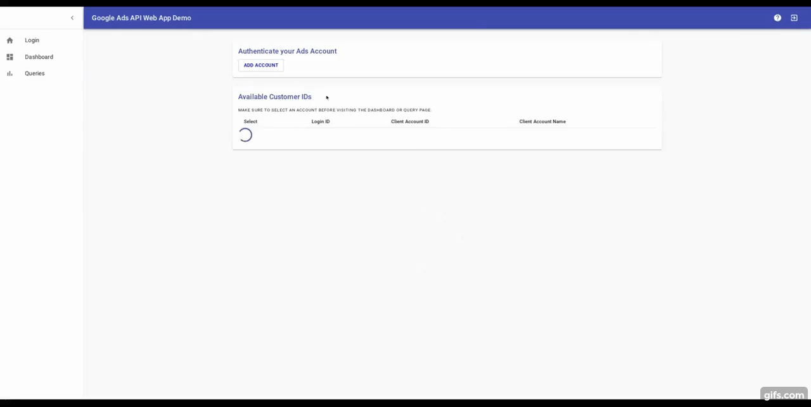
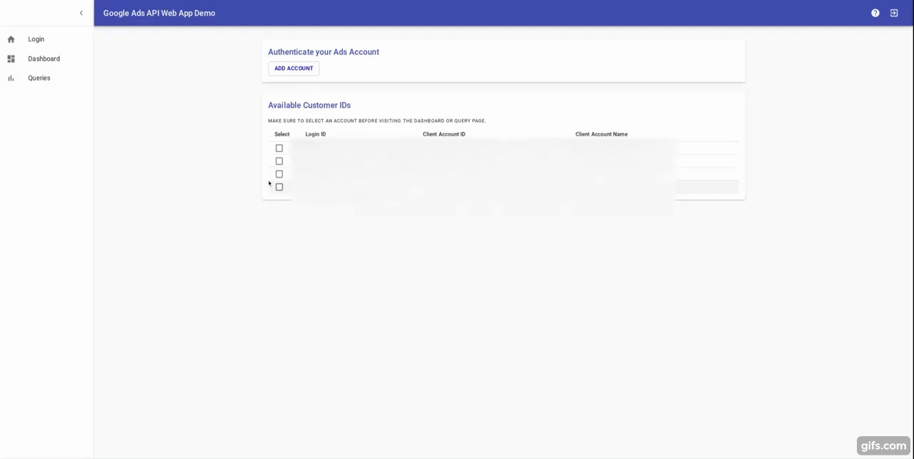
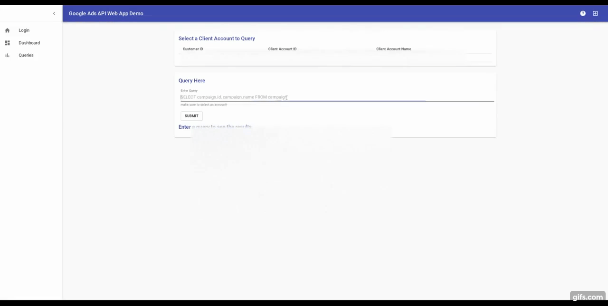
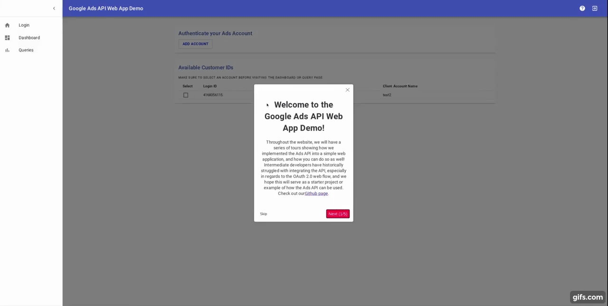

# Google Ads API Demo Web App

## About this Project
The Google Ads dashboard provides a useful UI for users to create and measure their campaigns, but the platform is limited in scale and customization for users with thousands of accounts that need to be accessed. The Google Ads API provides a solution to these limitations by providing the opportunity to develop around a code base, but less experienced developers have historically struggled with integrating the API into their own web application, especially in regards to the OAuth 2.0 web flow, thus introducing the need for a demonstrative, open source application. This application can be used as a starter project or as an example of how to use the Ads APIs.

Preview the project [here](http://app-infra-transformer-step.appspot.com/)

Read the developer guide for this project [here](DemoGuide.pdf)

## Front End with React

### To start the Front End, run the following:

`cd client`  
`npm run local`

### To test the Front End, run the following:

`cd client`  
`npm run test`

### To view Front End Test Code Coverage, run the following:

`cd client`  
`npm run coverage`

## Back End with Java8

### To start the Back End, run the following:
`mvn package appengine:run`
or 
`mvn package appengine:run -DskipTests`

### To test the Back End, run the following:
`mvn test`

## Hosted on Google App Engine
### To deploy the app:

1. `npm run build`
1. Copy the `build` folder into `src/main` of `portfolio` and rename `webapp`. The static files of the React App will be served from here
1. `mvn package appengine:deploy`

## View some demos!
### Login Page

### Dashboard Page

### Query Page

### User Tour

